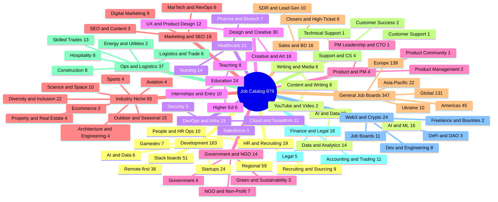

# Job Catalog — mind map

All 879 sources as 18 categories and their subcategories.
GitHub renders the diagram below. Offline version: `mindmap.html`.

```mermaid
mindmap
  root((Job Catalog 879))
    Development 183
      Remote-first 36
      Regional 59
      Stack boards 51
      Startups 24
      Gamedev 7
      AI and Data 6
    AI and Data 30
      AI and ML 16
      Data and Analytics 14
    DevOps and Infra 19
      Security 5
      Cloud and Sysadmin 11
      Salesforce 3
    Design and Creative 30
      UX and Product Design 12
      Creative and Art 18
    Product and PM 4
      Product Management 2
      PM Leadership and CTO 1
      Product Community 1
    Marketing and SEO 18
      Digital Marketing 9
      SEO and Content 3
      MarTech and RevOps 6
    Sales and BD 16
      SDR and Lead Gen 10
      Closers and High-Ticket 6
    Support and CS 4
      Customer Support 1
      Customer Success 2
      Technical Support 1
    Ops and Logistics 37
      Construction 8
      Skilled Trades 13
      Logistics and Trade 6
      Hospitality 8
      Energy and Utilities 2
    Finance and Legal 16
      Accounting and Trading 11
      Legal 5
    Web3 and Crypto 24
      Job Boards 11
      Dev and Engineering 8
      DeFi and DAO 3
      Freelance and Bounties 2
    HR and Recruiting 19
      Recruiting and Sourcing 9
      People and HR Ops 10
    Content and Writing 8
      Writing and Media 6
      YouTube and Video 2
    Healthcare 21
      Nursing 14
      Pharma and Biotech 7
    Education 24
      Internships and Entry 10
      Teaching 8
      Higher Ed 6
    Government and NGO 14
      Government 4
      NGO and Non-Profit 7
      Green and Sustainability 3
    Industry Niche 65
      Diversity and Inclusion 22
      Outdoor and Seasonal 15
      Science and Space 10
      Ecommerce 2
      Property and Real Estate 4
      Architecture and Engineering 4
      Sports 4
      Aviation 4
    General Job Boards 347
      Global 131
      Europe 139
      Ukraine 10
      Americas 45
      Asia-Pacific 22
```
